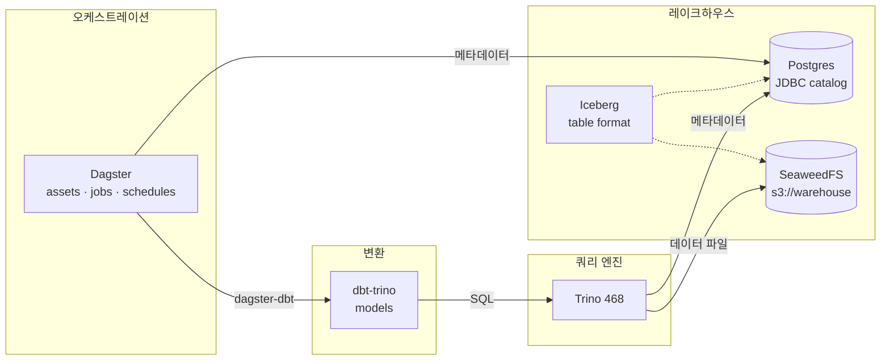
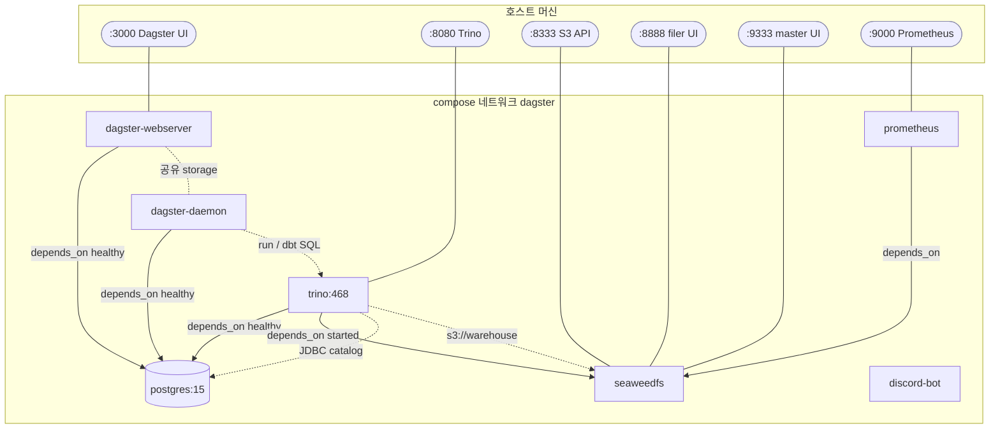
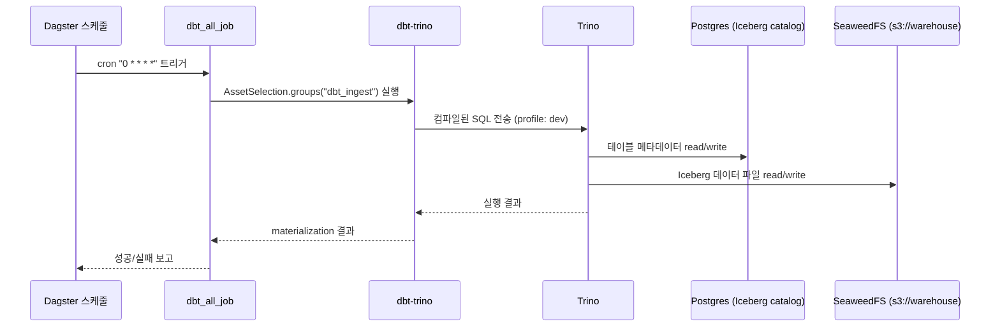
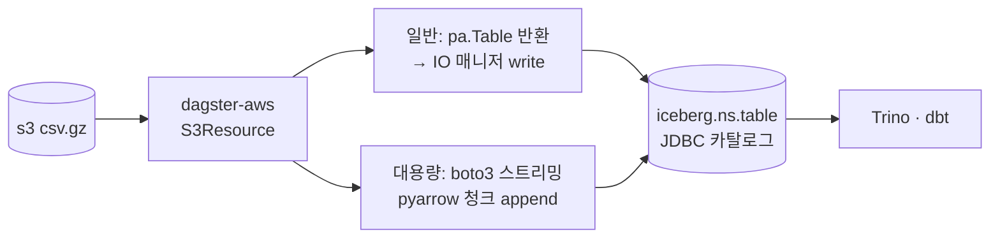

# 아키텍처 / 데이터 흐름

## 개요

`dagster-study`는 **Dagster로 오케스트레이션하고, Trino로 쿼리하며, Iceberg 테이블 포맷을
SeaweedFS(S3 호환) 위에 적재하는** 로컬 레이크하우스 학습 프로젝트다.
전체 스택은 `compose.yml`로 컨테이너 오케스트레이션한다.

## 구성 요소

| 서비스               | 이미지 / 위치              | 역할                                                                  |
| -------------------- | -------------------------- | --------------------------------------------------------------------- |
| `dagster-webserver`  | `dagster/dockerfile.d/`    | Dagster UI/GraphQL. `workspace.yaml`로 코드 로케이션 로드             |
| `dagster-daemon`     | `dagster/dockerfile.d/`    | 스케줄·센서·런큐 처리 + run 실행(`DefaultRunLauncher` 서브프로세스)   |
| `trino`              | `trinodb/trino:468`        | 분산 SQL 쿼리 엔진. dbt가 접속하는 대상                               |
| `postgres`    | `postgres:15`              | ① Dagster 메타데이터 저장소 ② Iceberg **JDBC 카탈로그** 저장소        |
| `seaweedfs`   | `chrislusf/seaweedfs`      | S3 호환 오브젝트 스토리지. Iceberg 데이터 파일(`s3://warehouse`) 저장 |
| `discord-bot` | `discord-py/dockerfile.d/` | Discord 봇 (Ollama Cloud 연동)                                        |
| `prometheus`  | `prom/prometheus:v2.21.0`  | 메트릭 수집                                                           |

## 데이터 흐름



## 컨테이너 구성도 (compose)

`compose.yml`의 서비스 의존성과 포트 매핑.



> `dagster-webserver`·`dagster-daemon`·`trino`는 `postgres` 헬스체크 통과 후 기동된다(`depends_on: condition: service_healthy`).
> webserver와 daemon은 같은 이미지·`dagster.yaml`을 쓰고 **Postgres 공유 storage**(run/event/schedule)로 상태를 협조한다. `trino`는 `seaweedfs`도 의존한다.

## Dagster 프로세스 분리 (webserver / daemon)

개발 편의용 일체형 `dg dev`(webserver+daemon+code 단일 프로세스) 대신, 운영 토폴로지로
**webserver와 daemon을 별도 컨테이너로 분리**한다.

| 프로세스             | entrypoint / command                          | 역할                                                       |
| -------------------- | --------------------------------------------- | ---------------------------------------------------------- |
| `dagster-webserver`  | `dagster-webserver -h 0.0.0.0 -p $PORT -w workspace.yaml` | UI/GraphQL 서빙(가벼움)                          |
| `dagster-daemon`     | `dagster-daemon run -w workspace.yaml`        | 스케줄·센서·런큐 디스패치 + run 서브프로세스 실행(무거움)   |

- **공유 storage 필수**: `dagster.yaml`의 run/event/schedule storage가 모두 **Postgres**라
  두 프로세스가 같은 상태를 보고 협조한다. `DagsterDaemonScheduler`+`QueuedRunCoordinator`는
  **daemon이 떠 있어야** 스케줄·큐가 처리된다.
- **run 실행 위치**: `DefaultRunLauncher`라 run은 **daemon 컨테이너에서 서브프로세스**로 돈다
  → daemon에 자원을 더 배정한다(compose `deploy.resources`).
- **코드 로케이션**: 독립 바이너리는 자동발견 대신 [`workspace.yaml`](../dagster/dockerfile.d/src/workspace.yaml)
  (`python_module: dagster_project.definitions`)로 명시 로드한다.
- **manifest 사전생성**: webserver/daemon은 비-dev라 `DbtProject.prepare_if_dev()`가 no-op이므로,
  이미지 빌드(`Dockerfile`)에서 `dbt deps && dbt parse`로 `target/manifest.json`을 미리 만들어
  `@dbt_assets` 로드를 보장한다.
- (추후) 무중단 배포·코드 격리가 필요하면 독립 gRPC code-server(`dagster code-server start`)를
  더해 3-way로 승격할 수 있다.

## dbt 실행 시퀀스

스케줄(`dbt_all_schedule`, 매시 정각)이 잡을 트리거할 때의 흐름.



## 레이크하우스 상세

### Iceberg 카탈로그 (Trino)

`trino/etc/catalog/iceberg.properties`에서 정의한다.

- **카탈로그 타입**: JDBC (`iceberg.catalog.type=jdbc`)
- **카탈로그 저장소**: Postgres `iceberg_catalog` DB 재사용
- **데이터 웨어하우스 경로**: `s3://warehouse` (SeaweedFS)
- **파일시스템**: `fs.native-s3.enabled=true`, endpoint `http://seaweedfs:8333`, path-style 접근

> 비밀정보(액세스 키 등)는 properties에 직접 쓰지 않고 `${ENV:...}`로 치환한다.
> 카탈로그 디렉토리는 컨테이너에 **읽기전용(`:ro`)** 으로 마운트한다.

### dbt → Trino 접속 (profiles)

`dbt_pipelines/profiles.yml` (`type: trino`):

| target       | schema | threads | 비고                      |
| ------------ | ------ | ------- | ------------------------- |
| `dev` (기본) | `dev`  | 4       | 인증 없음(`method: none`) |
| `prod`       | `prod` | 8       | 인증 없음                 |

- `database: iceberg` → Trino 카탈로그명(= `iceberg.properties`의 `catalog-name`)과 일치해야 한다.
- `schema` → Trino 스키마. 없으면 dbt가 생성한다.

## bronze 적재 (S3 csv.gz → Iceberg)

이미 S3에 적재된 `csv.gz` 원본을 **메타스토어 없이** Iceberg(JDBC 카탈로그) 테이블로 올린다.
**공통 로직은 `dagster_project/common/`** 에 두고, **에셋은 데이터셋별 서브프로젝트**
(`defs/mimic_iv/`, `defs/eicu/`)에서 **각각 명시적으로 정의**한다(팩토리 미사용).

S3/Iceberg 연결은 **Dagster 리소스**(`dagster-aws`·`dagster-iceberg`)로 관리한다.

### 공통 모듈 (`dagster_project/common/`) — 데이터셋 무관, 재사용

| 파일            | 역할                                                                                          |
| --------------- | --------------------------------------------------------------------------------------------- |
| `constants.py`  | 카탈로그명·warehouse·S3 엔드포인트·기본값(chunk/namespace/group)                              |
| `helper.py`     | `read_csv_gz_table()`(일반: 통째 읽어 pa.Table) · `load_heavy_csv_gz_to_iceberg()`(대용량: 청크 append) |
| `dbt.py`        | 공유 `DbtProject`·`build_dbt_resource` (단일 dbt 프로젝트를 데이터셋 subproject가 공유) |

### 서브프로젝트 (`defs/<dataset>/`) — 데이터셋별, **정의만**(load_defs가 자동발견)

| 파일             | 역할                                                                          |
| ---------------- | ----------------------------------------------------------------------------- |
| `constants.py`   | 데이터셋 전용 `NAMESPACE`·`GROUP_NAME`·`SOURCE_BASE`                          |
| `assets.py`      | 테이블별 **명시적 `@dg.asset`**(bronze; 일반=IO 매니저 / 대용량=청크 append)   |
| `dbt_assets.py`  | 데이터셋 dbt 모델 소유 `@dbt_assets(select="fqn:<dataset>", project=dbt_project)` |

> 현재 `defs/mimic_iv/`(icu·hosp 11테이블 — 일반=IO 매니저, chartevents·labevents=대용량),
> `defs/eicu/`(3테이블 — patient·diagnosis=일반, nurse_charting=대용량).
> 공유 리소스는 `defs/resources.py`(`@dg.definitions`), 잡·스케줄은 `defs/automation.py`에 두고,
> 최상위 `definitions.py`의 `load_defs(dagster_project.defs)`가 모두 **단일 `Definitions`** 로 합친다.

### 두 가지 적재 경로

| 경로 | 조건 | 방법 | 자산 반환 |
| --- | --- | --- | --- |
| **A. 일반** | 부하 없는 CSV | `read_csv_gz_table` → **dagster-iceberg IO 매니저**가 자동 create+write | `pa.Table` |
| **B. 대용량** | 무거운 csv.gz(예: 3.3GB) | boto3 스트리밍 + **청크 append**(IO 매니저 미사용) | `MaterializeResult` |



### 핵심 설계

- **리소스로 관리**: S3는 `dagster-aws` `S3Resource`, Iceberg는 `dagster-iceberg`(IO 매니저 + `IcebergTableResource`). 연결 설정은 자산이 아니라 리소스에 둔다(관심사 분리).
- **메타스토어 불필요**: dagster-iceberg가 Trino와 **동일한 Iceberg JDBC 카탈로그**(Postgres `iceberg_catalog`)를 재사용한다.
- **대용량 대응**: 3.3GB급 csv.gz는 IO 매니저(전량 메모리) 대신 `pyarrow` 청크 단위 `append`로 메모리 일정.
- **멱등성**: 대용량 경로 `mode="replace"`(기본)는 기존 테이블 제거 후 재적재.
- **에셋은 각각 명시적으로 정의**(팩토리/클래스 지양) — `CLAUDE.md` 컨벤션 준수.

### 사용법 (테이블 추가)

```python
# 일반 파일 — IO 매니저가 적재 (assets.py)
@dg.asset(group_name=GROUP_NAME, io_manager_key="io_manager_mimiciv", kinds={"python", "iceberg", "bronze"})
def admissions(s3: S3Resource) -> pa.Table:
    """MIMIC-IV hosp.admissions 적재."""
    return read_csv_gz_table(s3, f"{SOURCE_BASE}/hosp/admissions.csv.gz")
```

대용량(현재 `chartevents`·`labevents`·`nurse_charting`)은 `load_heavy_csv_gz_to_iceberg`를
호출하고, 대상 테이블용 `IcebergTableResource`를 `defs/resources.py`의 `resources`에 추가한다.

### 검증 상태

컨테이너 `dg check defs`로 **정의 로드 검증 통과**(`All definitions loaded successfully`).
- 빌드: python:3.13-slim에서 `dagster-iceberg==0.3.14`·`pyiceberg-0.11.1`·`pyarrow-24.0.0` 휠 정상 설치.
- ⚠️ **자산 모듈에서 `from __future__ import annotations` 금지**: Dagster가 `context`를 클래스 identity로 검사하므로 future annotations(문자열화) 시 로드 실패. 상세 [`conventions/dagster.md`](conventions/dagster.md).
- 미검증(런타임): boto3 `StreamingBody`↔pyarrow 대용량 스트리밍, 실제 S3/Iceberg 적재 — postgres·seaweedfs 기동 후 머티리얼라이즈로 확인 필요.

## 실행 방법

자세한 환경변수·실행 절차는 루트 [`README.md`](../README.md) 참고.

```bash
# 1. .env 작성 (POSTGRES_*, AWS_*, DISCORD_BOT_TOKEN 등)

# 2. 전체 스택 기동
docker compose up -d --build      # docker
podman-compose up -d --build      # podman

# 3. Dagster UI
#    http://localhost:3000

# 4. dbt 모델 추가 — 스캐폴딩 불필요(pythonic @dbt_assets로 코드 정의)
#    models/<dataset>/ 에 .sql 추가 → 데이터셋 subproject의 @dbt_assets(select)가 자동 반영
```

### 주요 포트

| 포트 | 서비스                          |
| ---- | ------------------------------- |
| 3000 | Dagster UI                      |
| 8080 | Trino                           |
| 8333 | SeaweedFS S3 API                |
| 8888 | SeaweedFS filer UI              |
| 9333 | SeaweedFS master UI             |
| 9000 | Prometheus (컨테이너 9090 매핑) |

## 참고

- Dagster — Docker 배포: https://docs.dagster.io/deployment/oss/deployment-options/docker
- Dagster — `dagster.yaml`: https://docs.dagster.io/deployment/oss/dagster-yaml
- dbt-trino: https://github.com/starburstdata/dbt-trino
- Trino — Iceberg connector: https://trino.io/docs/current/connector/iceberg.html
- Apache Iceberg: https://iceberg.apache.org/docs/latest/
- PyIceberg: https://py.iceberg.apache.org/
- SeaweedFS: https://github.com/seaweedfs/seaweedfs
