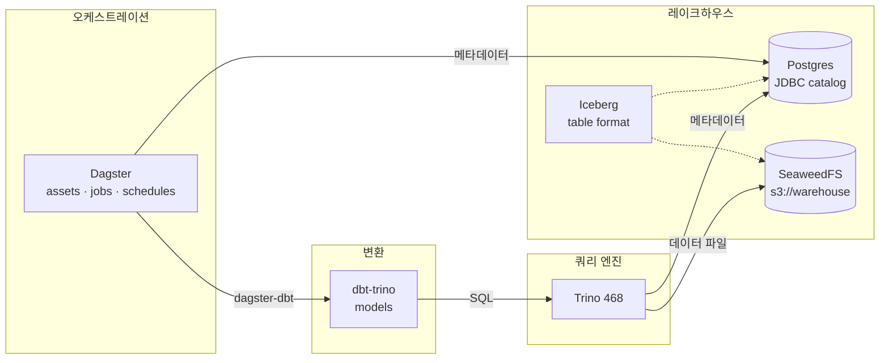
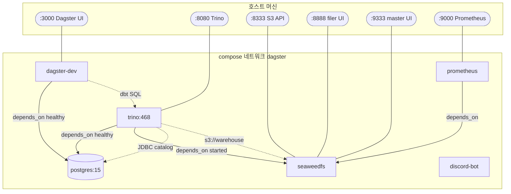
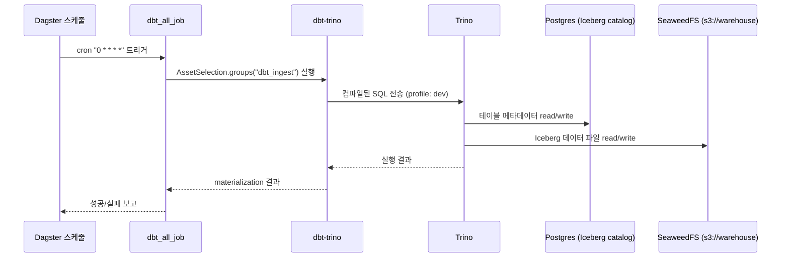
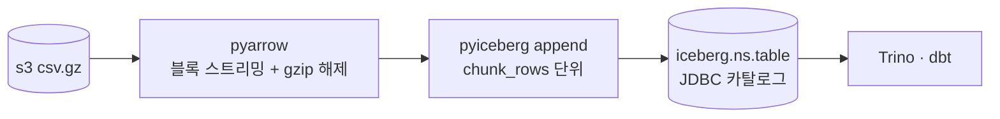

# 아키텍처 / 데이터 흐름

## 개요

`dagster-study`는 **Dagster로 오케스트레이션하고, Trino로 쿼리하며, Iceberg 테이블 포맷을
SeaweedFS(S3 호환) 위에 적재하는** 로컬 레이크하우스 학습 프로젝트다.
전체 스택은 `compose.yml`로 컨테이너 오케스트레이션한다.

## 구성 요소

| 서비스        | 이미지 / 위치              | 역할                                                                  |
| ------------- | -------------------------- | --------------------------------------------------------------------- |
| `dagster-dev` | `dagster/dockerfile.d/`    | 오케스트레이션. 에셋·잡·스케줄 정의 및 실행 UI(`dg dev`)              |
| `trino`       | `trinodb/trino:468`        | 분산 SQL 쿼리 엔진. dbt가 접속하는 대상                               |
| `postgres`    | `postgres:15`              | ① Dagster 메타데이터 저장소 ② Iceberg **JDBC 카탈로그** 저장소        |
| `seaweedfs`   | `chrislusf/seaweedfs`      | S3 호환 오브젝트 스토리지. Iceberg 데이터 파일(`s3://warehouse`) 저장 |
| `discord-bot` | `discord-py/dockerfile.d/` | Discord 봇 (Ollama Cloud 연동)                                        |
| `prometheus`  | `prom/prometheus:v2.21.0`  | 메트릭 수집                                                           |

## 데이터 흐름



## 컨테이너 구성도 (compose)

`compose.yml`의 서비스 의존성과 포트 매핑.



> `dagster-dev`·`trino`는 `postgres` 헬스체크 통과 후 기동된다(`depends_on: condition: service_healthy`).
> `trino`는 `seaweedfs`도 의존한다.

## dbt 실행 시퀀스

스케줄(`dbt_all_schedule`, 매시 정각)이 잡을 트리거할 때의 흐름.



## 레이크하우스 상세

### Iceberg 카탈로그 (Trino)

`trino/etc/catalog/iceberg.properties`에서 정의한다.

- **카탈로그 타입**: JDBC (`iceberg.catalog.type=jdbc`)
- **카탈로그 저장소**: Postgres `iceberg_catalog` DB 재사용
- **데이터 웨어하우스 경로**: `s3://warehouse` (SeaweedFS)
- **파일시스템**: `fs.native-s3.enabled=true`, endpoint `http://seaweedfs:8333`, path-style 접근

> 비밀정보(액세스 키 등)는 properties에 직접 쓰지 않고 `${ENV:...}`로 치환한다.
> 카탈로그 디렉토리는 컨테이너에 **읽기전용(`:ro`)** 으로 마운트한다.

### dbt → Trino 접속 (profiles)

`dbt_pipelines/profiles.yml` (`type: trino`):

| target       | schema | threads | 비고                      |
| ------------ | ------ | ------- | ------------------------- |
| `dev` (기본) | `dev`  | 4       | 인증 없음(`method: none`) |
| `prod`       | `prod` | 8       | 인증 없음                 |

- `database: iceberg` → Trino 카탈로그명(= `iceberg.properties`의 `catalog-name`)과 일치해야 한다.
- `schema` → Trino 스키마. 없으면 dbt가 생성한다.

## bronze 적재 (S3 csv.gz → Iceberg)

이미 S3에 적재된 `csv.gz` 원본을 **메타스토어 없이** Iceberg(JDBC 카탈로그) 테이블로 올린다.
**공통 로직은 `dagster_project/common/`** 에 두고, **에셋은 데이터셋별 서브프로젝트**
(`defs/mimic_iv/`, `defs/eicu/`)에서 **각각 명시적으로 정의**한다(팩토리 미사용).

### 공통 모듈 (`dagster_project/common/`) — 데이터셋 무관, 재사용

| 파일           | 역할                                                                        |
| -------------- | --------------------------------------------------------------------------- |
| `constants.py` | 카탈로그명·warehouse·S3 엔드포인트·기본값(chunk/namespace/group)            |
| `utils.py`     | `load_iceberg_catalog()`(pyiceberg SqlCatalog), `get_s3_filesystem()`(s3fs) |
| `helper.py`    | `stream_csv_gz_to_iceberg()` 스트리밍 + `load_csv_gz_to_iceberg()` 적재 오케스트레이션(에셋 본문이 호출) |

### 서브프로젝트 (`defs/<dataset>/`) — 데이터셋별, 자동 로드

| 파일           | 역할                                                                        |
| -------------- | --------------------------------------------------------------------------- |
| `constants.py` | 데이터셋 전용 `NAMESPACE`·`GROUP_NAME`·`SOURCE_BASE`                        |
| `assets.py`    | 테이블별 **명시적 `@dg.asset`** (공통 `load_csv_gz_to_iceberg()` 호출)      |

> 현재 `defs/mimic_iv/`(patients·admissions), `defs/eicu/`(patient·lab) 예시 에셋 포함.
> 테이블 추가 = `assets.py`에 `@dg.asset` 함수를 하나 더 명시적으로 작성한다.

### 데이터 흐름



### 핵심 설계

- **메타스토어 불필요**: pyiceberg가 Trino와 **동일한 Iceberg JDBC 카탈로그**(Postgres `iceberg_catalog`)를 재사용한다. 적재한 테이블은 Trino/dbt에서 즉시 조회된다.
- **무거운 파일 대응**: `pyarrow.csv`로 블록 스트리밍하며 `chunk_rows`(기본 100만 행) 단위로 모아 한 번에 `append` → 메모리 일정, 작은 파일/스냅샷 폭증 방지. (Dagster I/O manager로 전량 메모리 적재 시 발생하던 부하를 회피)
- **멱등성**: `mode="replace"`(기본)는 기존 테이블 제거 후 재적재, `"append"`는 누적.
- **에셋은 각각 명시적으로 정의**(팩토리/클래스 지양) — `CLAUDE.md` 컨벤션 준수. 공통 로직만 `common/`에서 재사용.

### 사용법 (테이블 추가)

해당 서브프로젝트 `defs/<dataset>/assets.py`에 **명시적 `@dg.asset` 함수**를 추가한다.

```python
# defs/mimic_iv/assets.py
@dg.asset(group_name=GROUP_NAME, kinds={"python", "iceberg"})
def mimiciv_hosp_labevents(context: dg.AssetExecutionContext) -> dg.MaterializeResult:
    """S3 csv.gz → bronze_mimiciv.labevents 적재."""
    return load_csv_gz_to_iceberg(
        context,
        identifier=f"{NAMESPACE}.labevents",
        source_glob=f"{SOURCE_BASE}/hosp/labevents.csv.gz",
    )
```

`defs/` 하위라 `load_from_defs_folder`가 **자동 로드**한다(별도 등록 불필요).

### 활성화에 필요한 설정 (TODO)

1. 의존성: `pyproject.toml`에 `pyiceberg[sql-postgres,pyarrow]`·`pyarrow` 추가 (적재 시 필요)
2. (선택) `bronze_mimiciv`·`bronze_eicu` 그룹을 선택하는 잡/스케줄 정의

> 대용량 풀셋은 추후 *Parquet 변환 → Iceberg `add_files`(재작성 없이 등록)*로 확장 가능.

## 실행 방법

자세한 환경변수·실행 절차는 루트 [`README.md`](../README.md) 참고.

```bash
# 1. .env 작성 (POSTGRES_*, AWS_*, DISCORD_BOT_TOKEN 등)

# 2. 전체 스택 기동
docker compose up -d --build      # docker
podman-compose up -d --build      # podman

# 3. Dagster UI
#    http://localhost:3000

# 4. dbt 파이프라인 스캐폴딩 (dagster-dbt 컴포넌트)
dg scaffold defs dagster_dbt.DbtProjectComponent dbt_ingest \
  --project-path ./dbt_pipelines
```

### 주요 포트

| 포트 | 서비스                          |
| ---- | ------------------------------- |
| 3000 | Dagster UI                      |
| 8080 | Trino                           |
| 8333 | SeaweedFS S3 API                |
| 8888 | SeaweedFS filer UI              |
| 9333 | SeaweedFS master UI             |
| 9000 | Prometheus (컨테이너 9090 매핑) |

## 참고

- Dagster — Docker 배포: https://docs.dagster.io/deployment/oss/deployment-options/docker
- Dagster — `dagster.yaml`: https://docs.dagster.io/deployment/oss/dagster-yaml
- dbt-trino: https://github.com/starburstdata/dbt-trino
- Trino — Iceberg connector: https://trino.io/docs/current/connector/iceberg.html
- Apache Iceberg: https://iceberg.apache.org/docs/latest/
- PyIceberg: https://py.iceberg.apache.org/
- SeaweedFS: https://github.com/seaweedfs/seaweedfs
